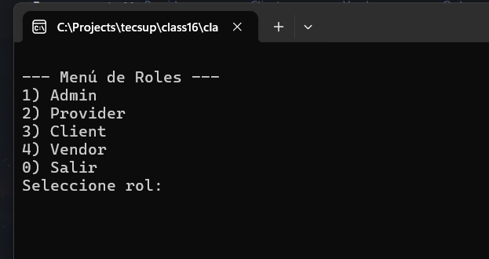

# Sistema de Librería en C#

## Descripción

Este es un sistema de consola desarrollado en C# que permite la gestión básica de una librería, incluyendo productos físicos y virtuales. Se aplican principios de Programación Orientada a Objetos (POO) como herencia, encapsulamiento e interfaces, así como los principios SOLID para lograr un diseño limpio y escalable.

El sistema permite la interacción mediante diferentes roles: Administrador, Proveedor, Cliente y Vendedor.

## Manual de Usuario

### Requisitos

- Tener instalado Visual Studio o .NET SDK (versión 6.0 o superior)

### Pasos para ejecutar el sistema

1. Abre el archivo `Program.cs` en Visual Studio.
2. Ejecuta el proyecto.
3. Se presentará el siguiente menú principal:

### Funcionalidades disponibles

1. **Administrador**
   - Crear nuevos productos (libros, cuadernos, lápices).
   - Actualizar precio y stock de productos existentes.

2. **Proveedor**
   - Reponer stock de productos disponibles en la tienda.

3. **Cliente**
   - Seleccionar y comprar productos del catálogo.
   - Aplicar descuentos por tipo de cliente, temporada o cupón.
   - Elegir método de pago: tarjeta, efectivo, Yape, Plin, etc.
   - Elegir entre venta física o en línea.

4. **Vendedor**
   - Confirmar ventas y entregar pedidos en tienda o en línea.

## Principios aplicados

- **Single Responsibility Principle (SRP)**: Cada clase tiene una única responsabilidad.
- **Open/Closed Principle (OCP)**: Se puede extender la funcionalidad (descuentos, pagos) sin modificar el código existente.
- **Liskov Substitution Principle (LSP)**: Las clases derivadas pueden sustituir a sus clases base sin errores.
- **Interface Segregation Principle (ISP)**: Interfaces pequeñas y específicas para distintos tipos de entrada (tarjeta, efectivo, etc.).
- **Dependency Inversion Principle (DIP)**: Se usan dependencias abstractas (interfaces) inyectadas en servicios.

## Estructura del Proyecto

/ (raíz del proyecto)
├── Program.cs
├── Admin.cs
├── Client.cs
├── Order.cs
├── PaymenthService.cs
├── Product.cs
├── Provider.cs
├── Repository.cs
├── Sales.cs
├── User.cs
├── Vendor.cs
└── /Tools
    ├── Discount.cs
    ├── DiscountServices.cs
    ├── PaymenthMethod.cs
    ├── Roles.cs
    └── SalesServices.cs

## Autor
Kelvin Pucho

## Docs

Verificar el archivo index.html de doxygen
https://github.com/kpzaolod6000/tecsup-LibrarySystem/blob/master/documents/doxygen/html/index.html